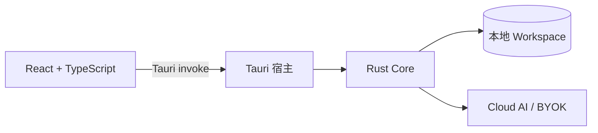

# AGENTS.md

给在此仓库工作的 AI agent 与开发者。改动任何一层前，请先通读本文件；本文件描述的是当前仓库的**事实约定**（取自代码），不是理想设计。

## 1. 项目概览

StudyPulse 是一个**本地优先的学习工作区桌面客户端**（macOS MVP，Tauri 2 + React 19 + Rust Core）。任务、科目成绩、考试、错题、学习计时、学习日记、趋势分析、文字闪卡、资料库和 Agent 工作全部保存在用户选择的本地 Workspace 目录中。

- 版本 `0.1.0`（`package.json`、`core/Cargo.toml` 的 `workspace.package.version`、`src-tauri/tauri.conf.json` 三处一致）。
- 目标平台 macOS 15+；`src-tauri/tauri.conf.json` 中 `macOS.minimumSystemVersion: "15.0"`，`core/.cargo/config.toml` 中 `MACOSX_DEPLOYMENT_TARGET=15.0`。
- AI 连接可选：Cloud AI 或 BYOK（OpenAI-compatible）二选一，也可完全不连接。没有 AI 时本地学习记录功能完整可用。
- 生产桌面应用**不依赖 Electron，也不对外提供浏览器 localhost 服务**。`npm run dev` 只是 Vite 前端预览，不能代替 Tauri 应用。

## 2. 架构与代码分层



| 目录 | 职责 | 关键文件 |
|---|---|---|
| `frontend/` | React 页面、i18n、Markdown 渲染、command 封装 | `src/app/App.tsx`（461 行，所有页面组件）、`src/app/P1Pages.tsx`（Diary/Trends/Flashcards）、`src/lib/core.ts`（command 封装）、`src/types.ts`（TS 类型）、`src/i18n.tsx`（5 语言字典）、`src/styles.css` |
| `src-tauri/` | Tauri 宿主：command 注册、对话框、深链、Keychain | `src/lib.rs`（全部 command，约 1000 行 + 测试）、`tauri.conf.json`、`capabilities/default.json` |
| `core/` | Rust workspace（edition 2024，rust-version 1.97.1，resolver 3） | 6 个 crate，见下 |

`core/` 的 crate 划分：

- **`studypulse-workspace`**（约 4400 行）— Workspace 存储（`workspace.rs`）、模型（`models.rs`）、SRS/趋势/快照（`analytics.rs`）、备份（`backup.rs`）、路径安全（`safe_path.rs`）、平台抽象（`platform.rs`）。
- **`studypulse-tools`**（1469 行）— Agent 工具注册表：定义、参数校验、权限分级、执行（含本机 Python 与 Docker Runner 代码执行）。
- **`studypulse-model-client`**（1770 行）— `ModelClient` trait、`CloudModelClient`、`OpenAICompatibleModelClient`、`MockModelClient`、错误分类。
- **`studypulse-agent`**（1364 行）— Agent runtime：`AgentMode`、事件时间线、确认/输入等待、循环上限。
- **`studypulse-ffi`**（3307 行）— 统一入口 `StudyPulseCore`（约 90 个方法）、全部 `*Dto`、`CoreError`；uniffi 0.30，可生成 Swift 绑定（`uniffi.toml`：`module_name = "StudyPulseCore"`）。
- **`studypulse-runner`**（275 行）— 可选容器化代码执行后端（Docker，`/health` + bearer token）。

数据流（严格单向）：前端 → `core.ts` 的 `core` 对象 → Tauri command → 宿主 `core_call`（内部 `spawn_blocking`）→ `StudyPulseCore` → 各 crate。Rust Core 是唯一能读写 Workspace 与凭据的层。

## 3. 存储格式（Workspace 布局）

创建 Workspace 时 `workspace.rs::Workspace::create` 会初始化：

```text
StudyPulseWorkspace/
├── Documents/                 # 资料库（导入的文本/Markdown）
├── Notes/                     # 笔记与可搜索文本
├── Data/
│   ├── *.jsonl                # 记录型数据（见下）
│   └── subjects.json / profile.json / plant_state.json / achievements.json / preferences.json
├── Media/images|audio/
├── Agent/
│   ├── runs/                  # Agent 事件日志：{run_id}.jsonl（每事件一行）
│   ├── artifacts/{run_id}/{artifact_id}.{ext}
│   ├── memory/workspace.json
│   ├── notebooks/{scope}/memory.json
│   └── notebooks.json         # Notebook 索引与对话历史（pretty JSON 数组）
└── .studypulse/
    ├── workspace.json         # {formatIdentifier, id, schemaVersion}，camelCase
    └── cache/imports、recovery、index/
```

**两种记录格式（重要，不要混用）**：

1. **JSONL 记录**（`Data/tasks.jsonl`、`grades`、`mistakes`、`exams`、`comprehensive_exams`、`phases`、`routines`、`routine_instances`、`diary_entries`、`study_sessions`、`time_investment_subjects`、`time_investment_subtasks`、`goal_rewards`、`coach_data`）— 每行是一个 `IosRecord<T>` 信封：
   ```json
   {"dtoVersion":1,"id":"<uuid>","updatedAt":"2026-08-01T10:00:00.000Z","value":{...},"extra":{...}}
   ```
   读取时校验：envelope id 必须等于 value.id；重复 UUID 报 `MalformedData`；`dtoVersion` 与 `extra` 都带 `#[serde(default)]`/`#[serde(flatten)]`，保证向前兼容。写入是 upsert（按 id 覆盖）+ 全量重写文件。
2. **JSON 数组文件**（`Data/subjects.json` 等）— pretty-printed JSON 数组，同样 upsert 语义。

**写入方式**：所有持久化写操作先取 `write_lock: Mutex<()>`（`WorkspaceInner` 内），再走 `atomic_write`（`workspace.rs:917`）——同目录下写 `.studypulse-write-{uuid}.tmp` → flush → 删除旧文件 → `rename`。**新写文件必须复用 `atomic_write`，不要直接 `fs::write`。**

**元数据与版本**：`.studypulse/workspace.json` 的 `format_identifier` 必须是 `com.chenkai.gao.studypulse.workspace`，`schema_version`（当前 1）只允许 ≤ 当前版本，未来版本拒绝打开（`WorkspaceError::InvalidWorkspace`）。`open()` 只读元数据，不重建目录。

## 4. 模型约定（models.rs 与 serde）

- 所有业务模型 `#[serde(rename_all = "camelCase")]`，**wire/存储字段是 camelCase**（如 `dueDate`、`isCompleted`、`coachExecutionData`）。
- 所有模型带 `#[serde(flatten)] pub extra: BTreeMap<String, Value>`（核心层）或 `extra_json: String`（前端/FFI DTO 层），用于承载未知字段——**新增业务字段前先考虑是否应放 extra**。
- 旧字段必须带 `#[serde(default)]`；可选字段 `Option<T>` + `#[serde(default)]`。反序列化必须容忍旧数据缺失新字段。
- 关键模型在读取和写入前调用 `validate()`（如 `TaskItem::validate` 检查 title 非空、importance ∈ 1..=5、三个时间戳可解析为 RFC3339、`coachExecutionData` 是合法 Base64）。校验失败返回 `WorkspaceError::MalformedData { path, detail }`，其中 `path` 带行号（如 `"Data/tasks.jsonl:42"`）。
- 时间戳：存储一律 RFC3339 UTC。写入时 `Utc::now().to_rfc3339_opts(SecondsFormat::Millis, true)`（信封 `updatedAt` 带毫秒）；工具内建默认时间用 `SecondsFormat::Secs`。
- ID 一律 `Uuid`（v4）。前端用 `crypto.randomUUID()` 生成。
- 复习质量映射（前端与后端同一约定）：**Again=1、Hard=3、Good=4、Easy=5**。

## 5. 路径安全（safe_path.rs）

这是产品刻意维持的硬边界，**改动必须保留**：

- `validate_wire_relative_path`：拒绝反斜杠、绝对路径（`/`、`//`）、Windows 盘符前缀（`C:`）、`..`、空段。所有来自 wire 的相对路径必须先过这道校验（`SafeRelativePath::parse`）。
- `ensure_no_symlink_components`：逐段 `symlink_metadata` 检查，任一组件是符号链接即拒绝（`SymbolicLink`）；`canonicalize` 后必须仍在 canonical root 内，否则 `PathEscape`。
- `resolve_existing` = parse + symlink 检查 + canonicalize + starts_with(root) 三重校验。
- `media_path` 只允许 `Media/images` 与 `Media/audio` 两类。
- `import_library_source`：文件名不能以 `.` 开头、不能含 `/`、`\`；内容必须 UTF-8 且不含 `\0`；同名文件自动改名为 `{stem}-{index}.{ext}`（`unique_source_name`）。
- 限制常量（改动需谨慎，产品承诺）：导入源 ≤ 1 MiB（`MAX_SOURCE_BYTES`，宿主层同值 `MAX_SEARCH_FILE_BYTES`）；搜索最多 50 条结果、逐文件 ≤ 1 MiB；媒体 ≤ 64 MiB（`MAX_MEDIA_FILE_BYTES`）；Agent artifact ≤ 10 MiB 且 run_id/artifact_id/extension 只能 `[A-Za-z0-9_-]`。
- Agent memory scope 白名单：`"workspace"` 或纯 `[A-Za-z0-9-]` 字符串（Notebook UUID）。

## 6. 备份（backup.rs）

- 格式标识 `com.chenkai.gao.studypulse.backup`；`REQUIRED_FILES` 清单（manifest.json、checksums.json、data/* 等 18 项）；zip 上限：条目 ≤ 10_000、单文件 ≤ 64 MiB、总量 ≤ 512 MiB。
- 导出流程：`export_backup` → 生成 manifest（schema_version、record_counts、includes_media 等）+ SHA-256 checksums。
- 导入流程：`inspect_backup`（校验 schema、统计 added/identical/conflicts，stage 到 `.studypulse/cache/imports/`，返回 `BackupInspection`）→ `apply_backup`（`RestoreMode::Replace | Merge` + `BackupResolution` 冲突决议）→ 返回 `ImportReport`（含 `recovery_path`，恢复前保留 recovery point）。
- Core 兼容 schema 3 与 schema 4 备份（见 `tests/fixtures/backup_manifest_v3.json`、`backup_manifest_v4.json`）。
- 当前桌面 UI 只走 Replace 路径（`App.tsx::importBackup`），Merge 与逐冲突决议是 Core 能力但 UI 未全暴露。

## 7. 分析 / SRS（analytics.rs）

- `learning_trends(now, range_days, diaries, grades, subjects, mistakes, sessions)`：`range_days` clamp 到 1..=90；生成 `[start, end]` 每天一个 `DailyTrendPoint`；活动点 = `study_minutes + review_count + grade_count × 5`；同日多条日记取 mood/energy 平均；连击 `activity_streak`（今天无活动则从昨天起算）。
- 科目趋势：按最近 3 条成绩算 change，> +0.05 → `rising`，< -0.05 → `falling`，否则 `steady`；`needs_attention` = 最近 ≥2 条且（均值 < 0.7 或 change < -0.15）。
- `apply_srs`（SM-2 兼容，与 iOS 的 1/3/4/5 一致）：quality 1 → repetitions 归零、interval 1、lapses+1、ease −0.20；3 → ×1.2 间隔、ease −0.15；4 → ×ease；5 → ×ease×1.3、ease +0.15；ease 钳制 [1.3, 3.0]。难度乘子：difficulty 1→0.5、2→0.75、4→1.3、5→1.6、其他→1.0。`next_review_date` 从**当天零点**起算。
- `today_snapshot`、`due_mistakes`（`next_review_date <= now`）、`srs_overview`（due ≤ now、upcoming ≤ now+7d）、`investment_summary`（direct/total 秒数 + session 数）都在此文件，纯函数风格，方便测试。
- 分析用 `mastery_history[].timestamp` 计算复习活动点；`MistakeNoteFull` 的 `review_state` 为 `None` 表示未入 SRS 队列（前端显示 "Add to review queue"）。

## 8. Agent 子系统

### 8.1 模式与能力清单（studypulse-agent/src/lib.rs）

6 种 `AgentMode`（snake_case 序列化），`capability_manifests()` 定义 stages 与 max_loops：

| 模式 | stages | max_loops |
|---|---|---|
| Chat | exploring, responding | 8 |
| DeepSolve | planning, solving, verifying, writing | 12 |
| Mastery | diagnosing, teaching, quizzing, reviewing | 10 |
| DeepResearch | rephrasing, decomposing, researching, reporting | 16 |
| QuestionLab | ideating, blueprinting, generating, checking | 10 |
| Visualize | analyzing, generating, reviewing | 5 |

全局上限 `MAX_AGENT_LOOPS = 8`（无 manifest 时的兜底）。`tool_is_enabled` **当前恒返回 true**（有意设计：给模型统一工具目录，执行期按权限拦截；注释在 `lib.rs:1025`，不要"修复"成按模式过滤）。

### 8.2 事件时间线

- `AgentEvent`：run_id + **单调递增 sequence（AtomicU64，从 1 起）** + timestamp + kind + 可选载荷。kind 共 14 种：`Started / StatusChanged / TextDelta / ToolRequested / ToolCompleted / ConfirmationRequired / StageStarted / StageProgress / StageCompleted / InputRequired / ArtifactCreated / Failed / Cancelled / Completed`。
- 事件双写：内存 `EventBuffer`（`wait_for_events(run_id, after_sequence, timeout_ms)` 用 `Condvar::wait_for`，timeout 上限 30s）+ 持久化到 `Agent/runs/{run_id}.jsonl`（追加，每事件一行）。
- 前端轮询协议：`waitAgentEvents(run_id, cursor, 1000)` 循环推进 cursor，直到收到 `Failed/Cancelled/Completed` 之一。**cursor 语义是"只返回 sequence > after_sequence 的事件"，前端用 `Math.max` 推进，不要用数组长度当游标。**
- 状态机：`RunStatus`（snake_case）：Started → Running ⇄ WaitingForConfirmation → (Failed | Cancelled | Completed)，Cancelling 是过渡态。
- 终端判定 `is_terminal()` = Failed | Cancelled | Completed；同一时刻只允许一个 active run（`AgentError::Busy`）。

### 8.3 确认与输入（安全关键路径）

- 工具执行前 `prepare()`（参数校验，产出 `prepared.preview` 供 UI 展示）→ 若 `permission != Read` 发 `ConfirmationRequired`，run 挂起等 `submit_confirmation(run_id, confirmation_id, Allow|Deny)`。
- 拒绝时给模型结构化结果 `{"ok": false, "error": {"code": "user_denied", ...}}`（agent 测试断言含 `"code":"user_denied"`）。
- `ask_user` 工具（Read 级）→ `InputRequired` 事件，`submit_agent_input` 提交 JSON 字符串（≤ 8 000 字符，非空）。
- 取消：`cancel_agent` 置 `cancelled` 原子标志 + `Notify` 唤醒模型等待 + condvar 唤醒确认/输入等待；模型请求用 `tokio::select! { biased; ... }` 让取消优先。
- 工具调用消息统一回填 `ChatMessage::Tool { call_id, name, content }` 继续模型循环；模型没有 tool_calls 时结束 run。

### 8.4 工具目录（studypulse-tools/src/lib.rs，12 个）

| 工具 | 权限 | 关键约束 |
|---|---|---|
| list_workspace_files | Read | 只列当前 Notebook 选中源（`source_paths` 为空时全库） |
| search_workspace | Read | query 非空；同样受选中源限制 |
| read_source | Read | **path 必须是当前选中源**；max_chars ∈ 1..=32 000（默认 12 000） |
| read_memory | Read | scope 白名单 |
| write_memory | Write | key 只含 `[A-Za-z0-9_-]` |
| web_search | Read | 需环境变量 `STUDYPULSE_SEARXNG_URL`（SearXNG JSON API）；query ≤ 200 字符、max_results ≤ 8 |
| paper_search | Read | arXiv API（XML 解析，quick-xml）；max_results ≤ 5 |
| code_execution | Execute | 见 8.5 |
| save_artifact | Write | 写入 `Agent/artifacts/`，≤ 10 MiB |
| ask_user | Read | prompt ≤ 1000 字符、options ≤ 6 |
| get_tasks | Read | 读取 StudyPulse 任务 |
| create_task | Write | 创建任务；默认 due=明天、importance=3；日期须为 RFC3339 |

约定：所有参数结构体 `#[serde(deny_unknown_fields)]`（严格拒绝多余字段）+ `schemars::JsonSchema`（工具 JSON Schema 自动生成给模型）；**prepare 只校验不执行、执行阶段（`execute_with_sources`）才碰 Workspace**——测试 `create_task_is_declared_write_and_does_not_write_during_prepare` 专门守护这一点。新增工具必须同时：加 `Invocation` 变体、`definitions()` 条目、`prepare()` 分支、`execute_with_sources()` 分支、参数结构体。

### 8.5 代码执行（两条后端）

- `STUDYPULSE_CODE_EXECUTION_BACKEND`（默认 `local`，可选 `docker`）：
  - **local**：`python3 -I -c <code>`（`-I` 隔离环境），`env_clear()`，在临时目录中运行（Drop 时删除）；timeout 默认 10s、上限 30s；stdin ≤ 64 KiB；stdout/stderr 各 ≤ 64 KiB 截断上报；Python 路径可用 `STUDYPULSE_PYTHON` 覆盖。**本机执行不是安全沙箱**（工具描述里也明确写了）。
  - **docker**：`RunnerManager` 管理临时容器（`--read-only --network none --cap-drop ALL --pids-limit 64 --memory 512m --cpus 1 --tmpfs /tmp:rw,noexec,nosuid,size=64m`，镜像 `studypulse-runner`，端口 127.0.0.1:45891）或连接外部 Runner（`STUDYPULSE_RUNNER_URL` + `STUDYPULSE_RUNNER_TOKEN` 成对配置）；执行前 `/health` 必须返回 `ok:true` 且 `isolation:"container"`，否则拒绝。
- 两个后端都以结构化 JSON 返回：`{ok, backend, exit_code, stdout, stderr, timed_out, output_truncated, duration_ms, ...}`。

### 8.6 模型客户端（studypulse-model-client）

- `ModelClient` trait：`async fn complete(request: ModelRequest, on_text_delta: ModelTextDeltaHandler) -> Result<ModelResponse, ModelError>`。
- `ModelRequest`（camelCase wire）：`{messages: ChatMessage[], tools: ModelToolDefinition[], mode?, stages?}`；`ChatMessage` 是 tagged enum（`{"role":"user"|"assistant"|"tool", ...}`）；`ModelResponse` = `{textDeltas: string[], toolCalls: [{id, name, arguments}]}`。
- `ModelToolDefinition.permission` 是**可选**的 host 侧权限提示字符串（默认 `"read"`），让弱模型理解工具契约；模型不直接执行工具。
- `CloudModelClient`：默认 API `https://spapi.chenkai.space`、登录 `https://auth.chenkai.space`；回调深链 `studypulse://auth/callback`，token 前缀校验 `sp_sess_` / `sp_refresh_`；`CloudProfile` 含 email/role/plan/available_models。
- `OpenAICompatibleModelClient`：base_url（默认 `https://api.openai.com/v1`）+ model + api_key。
- `ModelError` 分类：NotConfigured / InvalidUrl / InvalidAuthCallback / AuthRejected / SessionExpired / QuotaExceeded / AccessDenied / RequestTooLarge / InvalidResponse / Request。Agent 用 `finish_with_error` 把模型错误转成 Failed 事件。
- `MockModelClient`（无网络，测试用）：按已完成工具数推进 list_workspace_files → get_tasks → create_task → 结束，可驱动完整的确认流测试。

## 9. FFI 层（studypulse-ffi）

- 单一入口 `StudyPulseCore::new() -> Arc<Self>`，方法签名全部使用 `*Dto` 与 `String`（无 uniffi 不支持的类型）。
- `CoreError` 只有一个变体 `Failure { message }`，内部用 `map_err` 折叠各 crate 错误。
- `uniffi::setup_scaffolding!()` + `uniffi.toml`（Swift 绑定 `StudyPulseCore`，`generate_immutable_records = true`）。**加方法时同步加 DTO**；`/scripts/build-macos-core.sh`、`build-macos-xcframework.sh` 用于产出 macOS 绑定。
- 定时器状态（`start_timer/pause_timer/resume_timer/finish_timer/cancel_timer/active_timer`）、Agent run 事件等待（`wait_for_agent_events`）、备份会话（`inspect_backup/apply_backup/cancel_backup/wait_operation_events`）都是**进程内状态机**（`Mutex`/`Condvar`），不在 Workspace 落盘。
- `read_media` 返回原始字节（宿主层 base64 编码后发给前端）。

## 10. Tauri 宿主层（src-tauri/src/lib.rs）

- `AppState`：`Arc<StudyPulseCore>` + `preferences.json`（app_config_dir，内容仅 `{workspace_path, provider}`）+ `byok_config` 内存缓存。启动时若 preferences 里有存在的 workspace 路径则自动 `open_workspace`。
- **凭据只进 Keychain**（`keyring` crate）：Cloud token → service `space.chenkai.StudyPulse-Desktop.CloudAI`、account `session-token-pair`；BYOK → service `space.chenkai.StudyPulse-Desktop.BYOK`、account `openai-compatible`。**绝不写入 Workspace、localStorage、日志或序列化到前端**。
- 每个 command 是 `#[tauri::command]`，通过 `core_call`（`tauri::async_runtime::spawn_blocking`）执行，**禁止在 async command 里直接调用同步 Core 方法**（会阻塞主线程）。`read_command!` / `delete_command!` 两个宏覆盖简单 CRUD；所有 command 必须加进 `invoke_handler` 的 `generate_handler!` 列表（容易漏，改完 grep 确认）。
- `AppError`：`#[serde(rename_all = "camelCase")]`，变体 Core/InvalidInput/Credentials/File/State；**`lib.rs` 内有测试守护错误序列化不泄露 secret 字段**——新增错误路径时保持。
- 边界校验在宿主层再做一遍（不信任前端）：`import_library_file` 检查常规文件 + ≤ 1 MiB。
- `MAX_SOURCE_BYTES = 1_048_576`（1 MiB）与 Core 的 1 MiB 限制一致，两处都要改。
- 深链：`studypulse://auth/callback`（tauri.conf.json `plugins.deep-link.desktop.schemes: ["studypulse"]`），`onOpenUrl` 在 `App.tsx` 消费 → `completeCloudAuth`。
- CSP：`default-src 'self'; img-src 'self' data: blob:; style-src 'self' 'unsafe-inline'; script-src 'self' 'unsafe-eval'`。

## 11. 前端约定（frontend/）

### 11.1 command 封装（src/lib/core.ts）

- 唯一的 Tauri 调用点：`command<T>(name, args)` 走 `invoke`；`isDesktop = "__TAURI_INTERNALS__" in window`，非桌面直接抛错（有 vitest 测试守护"fails closed"）。
- `core` 对象方法名 camelCase，与 command snake_case 一一对应；参数对象在方法内转 snake_case（如 `{ input: { api_key, base_url, model } }`）。
- 文件对话框（chooseDirectory/chooseSourceFiles/…）在非桌面下返回 `null`/`[]` 而不是抛错。
- **TypeScript 类型字段保持 snake_case，与 Rust DTO 一致**（`is_completed`、`task_type`、`extra_json`）——这是刻意约定，避免两端反复映射；只有 `AgentMode` 等枚举保持 PascalCase 字符串值（与 Rust 枚举变体名一致）。

### 11.2 页面模式

- TanStack Query：查询 key 按资源命名（`["tasks"]`、`["diary"]`、`["trends", rangeDays]`、`["library-search", search]`）；写入用 `useMutation` + `onSuccess: () => queryClient.invalidateQueries({ queryKey: [...] })`。
- 新建记录：`crypto.randomUUID()` + `new Date().toISOString()`；所有记录带 `extra_json: "{}"`。
- 页面级 loading/error：`PageLoading`（skeleton）/ `ErrorCard`；交互错误 `window.alert(errorMessage(error, t))`。
- 全局 QueryClient（main.tsx）：`staleTime: 10_000, refetchOnWindowFocus: false, retry: 1`。
- 布局：`App.tsx` 侧边栏导航 `navigation` 数组（id → labelKey → icon），新增页面要同时加数组项、`{page === "x" && <XPage />}` 分支、i18n key。
- Agent 事件流在 `AgentPage` 内自管理（`useState` + 轮询循环），不走 react-query。

### 11.3 i18n（src/i18n.tsx）—— 高频 bug 源

- 5 种语言：`en`（基准）、`zh-CN`、`zh-TW`（`...zhCN` 浅拷贝后覆盖差异 key）、`ja`、`ko`。
- **P1 key 在独立的 `p1*` 字典里**（`p1En/p1ZhCN/p1ZhTW/p1Ja/p1Ko`），`dictionaries` 合并时 `{ ...en, ...p1En }`。新页面 key 放哪个字典取决于功能分组。
- 插值 `{count}` 风格，`interpolate` 支持 `{(\w+)}`；`localizeEnum(t, prefix, value)` 用于枚举文案（找不到 key 时回退原值）。
- **新增任何用户可见字符串必须补齐 5 语言 + 对应 p1 字典**。漏 key 会回退英文或直接显示 key 本身——这是最常见的遗漏。
- 语言检测/切换走 `localStorage["studypulse.language"]`。

### 11.4 样式与工具链

- `styles.css` 单一文件；主题通过 `document.documentElement.dataset.theme`（`light`/`dark`）切换，CSS 变量如 `--sage-dark`、`--clay`、`--plum`、`--gold`（TrendSvg 直接引用这些变量）。
- Vite：`server.port: 1420, strictPort: true`，`build.target: "safari15"`（别用太新的 JS 语法）。
- vitest：`environment: "node"`，只收集 `frontend/src/**/*.test.ts`（现有 `core.test.ts`）。
- TypeScript strict 模式；eslint：`js.configs.recommended` + `typescript-eslint` + react-hooks + react-refresh（`only-export-components` 警告，`i18n.tsx` 用 `/* eslint-disable react-refresh/only-export-components */` 豁免）。

## 12. 新增功能的标准链路（端到端清单）

以新增一个学习记录类型为例，按顺序：

1. **模型**：`studypulse-workspace/src/models.rs` 定义结构体（camelCase、`extra` flatten、`validate()`）。
2. **存储**：`workspace.rs` 加 `read_x / upsert_x / delete_x`（JSONL 走 `read_jsonl_records`/`upsert_jsonl_record`/`delete_jsonl_record`；JSON 走 `write_json_value`）。若创建新 JSONL 文件，记得加进 `Workspace::create` 的初始化清单和 `backup.rs::REQUIRED_FILES`。
3. **分析**（如需）：`analytics.rs` 加纯函数。
4. **FFI**：`studypulse-ffi` 加 `XDto` + `StudyPulseCore` 方法（`#[derive(uniffi::Record)]` 等）。
5. **宿主**：`src-tauri/src/lib.rs` 加 `#[tauri::command]`（CRUD 用宏）并注册到 `invoke_handler`；涉及密钥/路径边界时在宿主层补校验。
6. **前端封装**：`core.ts` 加 camelCase 方法；`types.ts` 加类型（snake_case 字段）。
7. **UI**：`App.tsx`（或 `P1Pages.tsx`）加页面。
8. **i18n**：`i18n.tsx` 补齐 5 语言（+ p1 字典）。
9. **测试**：workspace/analytics/tools/agent 侧加 Rust 单测（`tempfile::tempdir` 模式）；宿主层如有安全相关行为，按 `lib.rs` 现有测试模式补防泄漏测试；前端逻辑测试放 `frontend/src/**/*.test.ts`。
10. **验证**：见下节命令。

## 13. 环境变量汇总

| 变量 | 用途 | 默认 |
|---|---|---|
| `STUDYPULSE_CODE_EXECUTION_BACKEND` | 代码执行后端 `local`/`docker` | `local` |
| `STUDYPULSE_RUNNER_URL` | 外部 Runner 地址 | `http://127.0.0.1:45891` |
| `STUDYPULSE_RUNNER_TOKEN` | 外部 Runner 令牌（自定义 URL 时必填） | 无（自动生成） |
| `STUDYPULSE_SEARXNG_URL` | web_search 的 SearXNG 实例 | 无（未配置则工具报错） |
| `STUDYPULSE_PYTHON` | 本机 Python 路径覆盖 | 常见路径探测 |

## 14. 验证命令

前端（项目根目录）：

```sh
npm test          # vitest
npm run lint      # eslint（忽略 dist、src-tauri、core）
npm run typecheck # tsc -b --pretty false
npm run build     # tsc -b && vite build
```

Rust Core（项目根目录，通过 manifest 指定）：

```sh
cargo fmt --manifest-path core/Cargo.toml --all -- --check
cargo test --manifest-path core/Cargo.toml --workspace
cargo clippy --manifest-path core/Cargo.toml --workspace --all-targets -- -D warnings
```

- **clippy 必须零警告**（`-D warnings`）。
- Rust 测试用 `tempfile` 建临时 Workspace，不碰真实目录。
- 完整桌面构建：`npm run tauri:build`（`beforeBuildCommand: npm run build`）。仅前端 `npm run build` 不产生桌面 bundle。
- 浏览器预览 `npm run dev` 没有 Tauri runtime：除 `app_snapshot`（返回 null workspace）外的 command 全部抛错、对话框不可用——**验证功能必须 `npm run tauri:dev`**。

## 15. 分支与发布约定

- 功能分支 `agent/<topic>`（如 `agent/p1-foundation-loop`、`agent/rewrite-readme`），主线 `main`，存在 `codex/` 前缀的旧分支。
- 版本号三处同步：`package.json`、`core/Cargo.toml`（`workspace.package.version`）、`src-tauri/tauri.conf.json`。
- 发布说明类提交曾出现后被 revert（`199f09e Revert "Add v0.1.0 release notes"`）——发布流程以产品当前约定为准，不要凭旧提交推断。
- 最近一次功能提交 `9bbd543 Implement P1 diary trends and SRS` 说明 P1（Diary/Trends/Flashcards）刚完成，属新近代码，改动时注意保持其结构。

## 16. 易错点速查

1. **浏览器预览 ≠ 桌面应用**：`isDesktop` 守护，浏览器里 command 一律抛 "must be opened as the Tauri desktop application"。
2. **i18n 漏 key**：只写一种语言 = bug；P1 key 在 `p1*` 字典，别漏。
3. **字段命名混乱**：wire 是 snake_case（Tauri command）/camelCase（serde 模型）；前端类型跟 serde（snake_case）；包装方法 camelCase。新增字段时按层对应。
4. **新增记录没加 `extra`**：破坏向前兼容。
5. **绕过 `atomic_write` / `write_lock`**：直接 `fs::write` 会破坏崩溃安全与并发。
6. **绕过路径校验**：任何接受相对路径的入口都必须过 `SafeRelativePath` + symlink 检查。
7. **工具 prepare/execute 混做**：prepare 里执行副作用会破坏"先确认后执行"的安全模型（有测试守护）。
8. **command 没注册**：`generate_handler!` 漏加 = 前端 invoke 直接报 "not found"。
9. **async 里直接调同步 Core**：会阻塞 Tauri 事件循环，必须 `core_call`。
10. **API key/token 流到前端**：凭据只经 Keychain；`ProviderStatus` 是脱敏视图，BYOK 的 api_key 从不出现。
11. **serde 字段重命名**：枚举默认序列化为变体名（PascalCase），需要时显式 `rename_all`（`lowercase`/`snake_case`），别依赖默认。
12. **JSONL 信封格式**：`IosRecord<T>` 的 `value` 才是业务对象，读写都用信封辅助函数，不要手拼。
