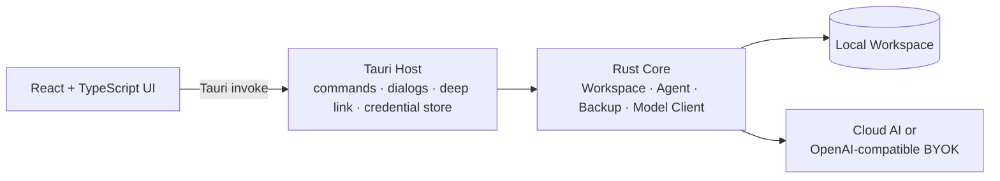

# StudyPulse

StudyPulse 是一个 **本地优先的学习工作区桌面客户端**。它把任务、科目成绩、考试、错题、学习计时、学习日记、Trends、文字闪卡、资料库和 Agent 工作放在同一个可迁移的本地 Workspace 中。

当前版本为 `0.1.0`，支持 macOS 与 Windows 桌面端：使用 Tauri 承载 React 界面，使用 Rust Core 负责 Workspace、数据读写、备份、Agent 运行时和模型提供商连接。AI 连接是可选的；没有 AI 时，任务、考试、错题、计时和本地资料管理仍然可以使用。

## 当前能力

### 本地学习工作区

- 创建或打开一个本地 StudyPulse Workspace。
- 在 Today 页面查看未完成任务、今日学习时长、连续学习天数、待复习错题和即将到来的考试。
- 管理任务、科目、成绩、单科考试和综合考试记录。
- 记录错题，将错题加入文字闪卡复习队列，并用 Again、Hard、Good、Easy 四档反馈推进 SM-2 复习状态。
- 使用学习计时器开始、暂停、继续、完成或取消一个学习 session。
- 创建时间投入主题，为学习时长分析保留结构化数据。
- 在学习日记中记录同日多条心情、精力、标签和 Markdown 内容，并查看 7/30 天节奏。
- 在 Trends 中查看 90 天活动热力图、学习时长、心情/精力、科目成绩趋势和 SRS 摘要。
- 在 Flashcards 中复习到期错题，支持会话进度、Again 重排和复习总结。

### 资料库与 Agent

- 将文本资料导入 Workspace 的 `Documents/`，在客户端内浏览和搜索。
- 为 Agent Notebook 选择资料作为上下文，并保存对话历史。
- 支持 Chat、Deep Solve、Mastery、Deep Research、Question Lab 和 Visualize 六种 Agent 模式。
- 以可见事件时间线展示 Agent 的阶段、状态、工具调用、产物和错误。
- Agent 的写入、破坏性操作和代码执行会先请求确认；需要补充信息时会暂停等待用户输入。

### AI Coach、考试规划与学习报告

- **AI Coach**：保存分数目标、科目基线/目标、权重、每日可用时间、目的和约束；生成预测、证据、风险和可审核的学习任务建议。批准建议后才会写入任务，也可以围绕目标进行教练对话。
- **Reverse Planner**：从考试日期、当前分数和目标分数倒推薄弱点、阶段路线和每日任务；生成时会把成绩、错题、SRS 到期队列和未完成任务作为上下文。
- **Exam Simulator**：按科目生成默认 10 道题、20 分钟的模拟考试，支持选择题和简答题；自动保存作答，记录跳题、改答案和超时等行为，并在交卷后生成得分与行为分析。
- **Learning Reports**：查看 7 天或 30 天的学习时长、session、成绩率、心情、每日趋势和考试/错题统计；可导出 Markdown、HTML、PNG，或使用系统打印生成 PDF，并打开/分享导出的文件。

AI Coach、Reverse Planner 和 Exam Simulator 需要在 Settings 中连接 Cloud AI 或 BYOK；Learning Reports 使用本地 Workspace 数据，不依赖 AI。

### AI 提供商

- **StudyPulse Cloud AI**：通过 `studypulse://auth/callback` 深链完成登录。
- **BYOK**：配置任意 OpenAI-compatible endpoint、模型和 API key。
- Cloud AI 与 BYOK 同时只能有一个处于 active 状态。
- AI Coach、Reverse Planner 和 Exam Simulator 的生成与分析功能需要已连接的提供商；本地学习记录和 Learning Reports 不受影响。
- AI 不连接时，Workspace 仍可作为独立的本地学习记录工具使用。

### 备份与恢复

- 导出 `.studypulsebackup` 备份，默认包含媒体文件和派生健康数据。
- 导入前先检查备份 schema、记录数量、冲突和警告。
- 当前桌面 UI 在确认后执行 Replace 恢复；恢复过程中会保留 recovery point。
- Core 的备份实现兼容已有 schema 3 和 schema 4 备份。

## 架构



代码按职责分为三层：

- `frontend/`：React 页面、国际化、Markdown 渲染和 Tauri command 调用封装。
- `src-tauri/`：Tauri 应用宿主、文件选择器、深链回调、系统凭据存取和前端命令边界。
- `core/`：Rust workspace，包含 Workspace 存储、Agent runtime、工具注册表、模型客户端、备份和 Runner。

生产桌面应用不依赖 Electron，也不对外提供浏览器 localhost 服务。开发时的 `npm run dev` 只是 Vite 前端预览，不能代替 Tauri 应用运行。

## 环境要求

- macOS 15 或更高版本，或 Windows 10/11
- Rust 1.97.1 或更高版本
- Node.js 24 或更高版本
- npm 11 或更高版本
- Windows 构建需要 Visual Studio 2022 Build Tools 的“使用 C++ 的桌面开发”工作负载和 WebView2 Runtime
- Docker Desktop：仅在使用 Docker 代码执行后端时需要

## 快速开始

在项目根目录执行：

```sh
npm install
npm run tauri:dev
```

首次启动后，可以创建一个新的 Workspace，也可以打开已有的 Workspace。

### 仅启动前端预览

```sh
npm run dev
```

Vite 默认使用 `http://localhost:1420`。由于浏览器预览没有 Tauri runtime，创建/打开 Workspace、文件选择、备份、AI 和 Agent command 不会正常工作；完整功能请使用 `npm run tauri:dev`。

### 构建桌面应用

```sh
npm run tauri:build
```

Tauri 会先执行前端构建，再生成当前平台的应用 bundle。Windows 上可显式生成 NSIS 与 MSI 安装器：

```powershell
npm run tauri:build:windows
```

产物位于 `src-tauri/target/release/bundle/nsis/` 与 `src-tauri/target/release/bundle/msi/`。完整的 Windows 环境、迁移和签名说明见 [`docs/WINDOWS.md`](docs/WINDOWS.md)。

## AI 配置

打开应用的 Settings 页面，选择一种提供商：

### Cloud AI

点击 Sign in，客户端会打开安全登录流程，并通过 `studypulse://auth/callback` 接收回调。登录 token 只由 Rust/Tauri 宿主处理，不会暴露给 React 页面。

### BYOK

填写：

- Base URL，例如 `https://api.example.com/v1`
- Model，例如提供商支持的模型名称
- API key

API key 保存后不会再次回显。切换提供商或断开连接时，客户端会清理对应的活动连接和已保存凭据。

## Agent 代码执行

Agent 的代码执行默认使用本机 Python，并且每次执行都需要用户确认。这个本机后端是权限流程，不是安全沙箱；不要把它当作隔离环境来运行不可信代码。

如果需要容器化执行，可以使用可选的 Runner：

```sh
cd core
cargo build --release -p studypulse-runner
docker build -f crates/studypulse-runner/Dockerfile -t studypulse-runner .
cd ..

STUDYPULSE_CODE_EXECUTION_BACKEND=docker npm run tauri:dev
```

默认情况下，客户端会在本机 Docker 可用且 Runner 镜像存在时管理一个临时容器。也可以连接外部 Runner，此时需要同时配置 `STUDYPULSE_RUNNER_URL` 和本地环境中的 `STUDYPULSE_RUNNER_TOKEN`：

```sh
STUDYPULSE_CODE_EXECUTION_BACKEND=docker \
STUDYPULSE_RUNNER_URL=http://127.0.0.1:45891 \
STUDYPULSE_RUNNER_TOKEN="$STUDYPULSE_RUNNER_TOKEN" \
npm run tauri:dev
```

Runner 会在执行前检查认证的 `/health`，并要求服务报告容器隔离状态。推荐的容器约束包括 loopback-only 端口、只读根文件系统、无网络、无宿主机挂载、非 root 用户，以及明确的 CPU、内存和进程限制。

更多 Runner 说明见 [`core/crates/studypulse-runner/README.md`](core/crates/studypulse-runner/README.md)。

## Workspace 目录

创建 Workspace 后，Rust Core 会初始化类似下面的目录结构：

```text
StudyPulseWorkspace/
├── Documents/              # 资料库文档
├── Notes/                  # 笔记与可搜索文本
├── Data/                   # 任务、成绩、考试、错题、学习 session 等记录
├── Media/
│   ├── images/
│   └── audio/
├── Agent/
│   ├── runs/               # Agent 运行记录
│   ├── artifacts/          # Agent 生成的产物
│   ├── memory/             # Workspace / Notebook memory
│   ├── notebooks/          # Notebook 作用域目录
│   └── notebooks.json      # Notebook 索引与对话历史
└── .studypulse/            # 元数据、缓存、索引和恢复点
```

Workspace 路径只保存在客户端偏好设置中；学习数据、Agent 运行和 Notebook 历史保存在用户选择的 Workspace 内。Workspace 的路径检查会拒绝路径穿越和符号链接逃逸。

## 隐私与安全边界

- 默认本地优先：不配置 AI 时，核心学习数据无需离开本机。
- Cloud AI token 和 BYOK API key 由系统安全凭据存储保存（macOS Keychain / Windows Credential Manager），不写入 Workspace、前端 localStorage、日志或源代码。
- React 只接收脱敏后的 provider status，例如已连接状态、账户信息或 BYOK 的 endpoint/model 配置，不接收已保存的 API key。
- Agent 工具按 Read、Write、Destructive、Execute 分级，并通过确认事件把需要用户决定的操作呈现出来。
- Workspace 只允许访问其自身目录内的受支持文件；资料搜索会跳过隐藏文件、符号链接和非文本文件。
- AI provider 负责模型请求边界；本地 Workspace 仍由 Rust Core 管理。

## 验证命令

前端检查：

```sh
npm test
npm run lint
npm run typecheck
npm run build
```

Rust Core 检查：

```sh
cargo fmt --manifest-path core/Cargo.toml --all -- --check
cargo test --manifest-path core/Cargo.toml --workspace
cargo clippy --manifest-path core/Cargo.toml --workspace --all-targets -- -D warnings
```

完整桌面构建：

```sh
npm run tauri:build
```

## 项目状态

这是一个持续演进中的 macOS / Windows 桌面客户端。当前客户端已覆盖本地 Workspace、学习记录与 SRS、P1 日记/趋势、备份恢复、AI Coach、考试规划/模拟、学习报告和带权限确认的 Agent 主流程。

Health/Recovery 模块尚未包含在当前客户端中；跨端同步、完整系统级日历/提醒集成、发布签名与分发流程也不属于当前默认能力。AI 生成结果仍需用户审核，代码执行的本机 Python 后端也不是安全沙箱。
