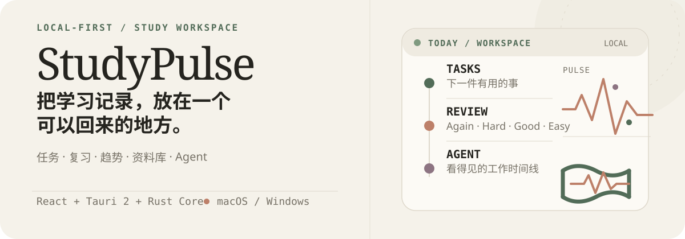
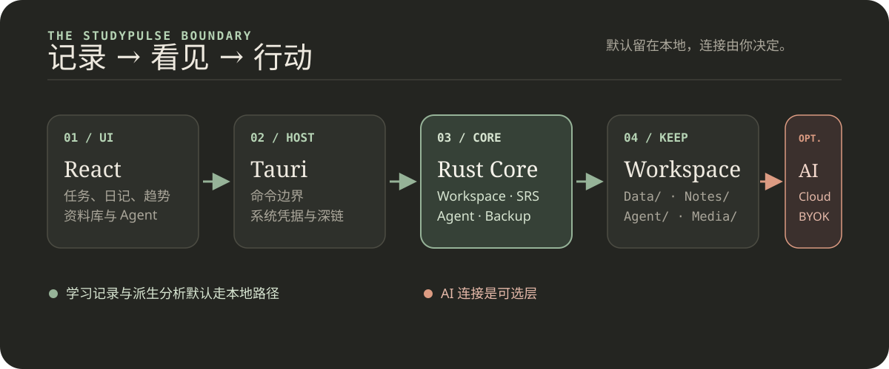

<p align="right">English · <a href="README.zh-CN.md">简体中文</a></p>

<p align="center">
  
</p>

# StudyPulse

> A local-first learning workspace desktop client. Keep tasks, grades, exams, mistakes, study time, diary entries, trends, your library, and Agent work in one portable Workspace.

<p>
  <code>macOS 15+</code>&nbsp;·&nbsp;
  <code>Windows 10/11</code>&nbsp;·&nbsp;
  <code>Tauri 2</code>&nbsp;·&nbsp;
  <code>React 19</code>&nbsp;·&nbsp;
  <code>Rust Core</code>
</p>

## What problem does it solve?

StudyPulse does not require an AI connection, and it does not scatter your learning records across separate tools. It brings daily action, review, and reflection into one local Workspace, then turns those records into trends, review queues, and next actions.

- **Record**: tasks, subjects and grades, exams, mistakes, timers, time investment, and study diary entries.
- **See**: a Today snapshot, activity streaks, a 90-day activity heatmap, study time, mood and energy, and subject trends.
- **Review**: turn mistakes into text flashcards and use Again / Hard / Good / Easy to advance an SM-2-compatible review state.
- **Act**: use the library and a permission-aware Agent; Cloud AI and BYOK are optional connections.

<p align="center">
  
</p>

## Quick start

### Desktop application

Requirements: macOS 15 or later, or Windows 10/11; Rust 1.97.1+; Node.js 24+; npm 11+.

```sh
npm install
npm run tauri:dev
```

On first launch, create a new Workspace or open an existing one.

### Frontend preview only

```sh
npm run dev
```

Vite uses `http://localhost:1420` by default. Browser preview has no Tauri runtime, so Workspace creation/opening, file pickers, backups, AI, and Agent commands will not work. Use `npm run tauri:dev` for the complete application.

### Build the desktop application

```sh
npm run tauri:build
```

On Windows, you can explicitly build NSIS and MSI installers:

```powershell
npm run tauri:build:windows
```

See [`docs/WINDOWS.md`](docs/WINDOWS.md) for Windows environment, migration, and signing notes.

## What can you actually use it for?

### Keep the day within reach

The Today page brings unfinished tasks, study time, activity streaks, mistakes due for review, and upcoming exams into one view. Tasks, grades, exams, and time investment are written to the local Workspace.

### Make progress visible

Study diary supports multiple entries per day, mood, energy, tags, and Markdown content. Trends provides 7/30-day diary rhythms and a 90-day learning overview: activity heatmap, study time, mood and energy, subject grade trends, and an SRS summary.

### Turn mistakes into review

Mistakes can enter the text flashcard queue. During review, see the prompt first and then respond with Again, Hard, Good, or Easy. Due cards can be reordered in one session, followed by a summary of that review session.

### Bring in an Agent when you need one

The library can import text and Markdown, and a Notebook can select sources as context. The Agent supports six modes—Chat, Deep Solve, Mastery, Deep Research, Question Lab, and Visualize—with a visible event timeline for stages, status, tool calls, artifacts, and errors.

## AI is an optional layer

Tasks, exams, mistakes, timers, diary, trends, review, library management, and reports remain available without an AI connection.

- **StudyPulse Cloud AI**: sign in through `studypulse://auth/callback`.
- **BYOK**: configure any OpenAI-compatible endpoint, model, and API key.
- Cloud AI and BYOK can only have one active provider at a time.
- Generation and analysis for AI Coach, Reverse Planner, and Exam Simulator require a connected provider. Learning Reports use local Workspace data and can export Markdown, HTML, or PNG, or produce a PDF through system printing.

## Local-first and permission boundaries

- Learning data, Agent runs, Notebook history, and imported sources stay in the user-selected Workspace directory.
- Cloud tokens and BYOK API keys go only to macOS Keychain / Windows Credential Manager. They are not written to the Workspace, browser `localStorage`, logs, or serialized frontend data.
- Rust Core is the only layer that reads or writes the Workspace and credentials; React receives only a redacted provider status.
- Agent tools are classified as Read, Write, Destructive, or Execute. Writes, destructive operations, and code execution require confirmation first.
- Workspace paths reject traversal, symlink escapes, hidden imported files, and files over the configured size limits.

## Agent code execution

Local Python is the default backend, and every execution requires user confirmation. The confirmation card clearly states that it is **not a security sandbox**. Without a Docker Runner, code runs with the current user's host permissions; do not use it for untrusted code.

For containerized execution, use the optional Runner:

```sh
cd core
cargo build --release -p studypulse-runner
docker build -f crates/studypulse-runner/Dockerfile -t studypulse-runner .
cd ..

STUDYPULSE_CODE_EXECUTION_BACKEND=docker npm run tauri:dev
```

You can also connect to an external Runner. Set both `STUDYPULSE_RUNNER_URL` and `STUDYPULSE_RUNNER_TOKEN`; a remote Runner URL must use HTTPS, while HTTP is limited to `localhost`, `127.0.0.1`, and `::1`. Before execution, the Runner checks an authenticated `/health` endpoint and requires the service to report container isolation. See [`core/crates/studypulse-runner/README.md`](core/crates/studypulse-runner/README.md) for more information.

## What does a Workspace look like?

After a Workspace is created, Rust Core initializes a directory structure similar to this:

```text
StudyPulseWorkspace/
├── Documents/              # Library documents
├── Notes/                  # Notes and searchable text
├── Data/                   # Tasks, grades, exams, mistakes, study sessions, etc.
├── Media/images|audio/     # User-imported media
├── Agent/
│   ├── runs/               # Agent run records
│   ├── artifacts/          # Agent-generated artifacts
│   ├── memory/             # Workspace / Notebook memory
│   ├── notebooks/          # Notebook scope directories
│   └── notebooks.json      # Notebook index and conversation history
└── .studypulse/            # Metadata, cache, indexes, and recovery points
```

Record data uses versioned JSONL envelopes; writes are protected by a process lock and atomic write. Workspace schema accepts the current and earlier versions, and refuses to open a future version.

## Architecture and code layers

```text
frontend/       React pages, i18n, Markdown, and Tauri command wrappers
src-tauri/      Tauri host, file pickers, deep links, system credentials, and command boundaries
core/           Rust workspace: storage, analytics, Agent, tools, model clients, backups, and Runner
```

The production desktop application does not depend on Electron or expose a browser localhost service. `npm run dev` is only a Vite frontend preview and cannot replace the Tauri application.

## Development checks

Frontend:

```sh
npm test
npm run lint
npm run typecheck
npm run build
```

Rust Core:

```sh
cargo fmt --manifest-path core/Cargo.toml --all -- --check
cargo test --manifest-path core/Cargo.toml --workspace
cargo clippy --manifest-path core/Cargo.toml --workspace --all-targets -- -D warnings
```

Complete desktop build:

```sh
npm run tauri:build
```

## Current status and boundaries

The current client covers the local Workspace, learning records and SRS, Diary / Trends / Flashcards, backup and restore, AI Coach, exam planning and simulation, Learning Reports, and the permission-confirmed Agent flow.

The Health/Recovery module is not included in the current client. Cross-device sync, full system calendar and reminder integration, release signing, and distribution are also outside the default capabilities. AI-generated results still require user review, and the local Python execution backend is not a security sandbox.

## Maintenance

This lightweight README update was completed by Codex.

<sub>The desktop version metadata in this repository is <code>0.7.0</code>; release status is determined by the actual GitHub Release.</sub>
