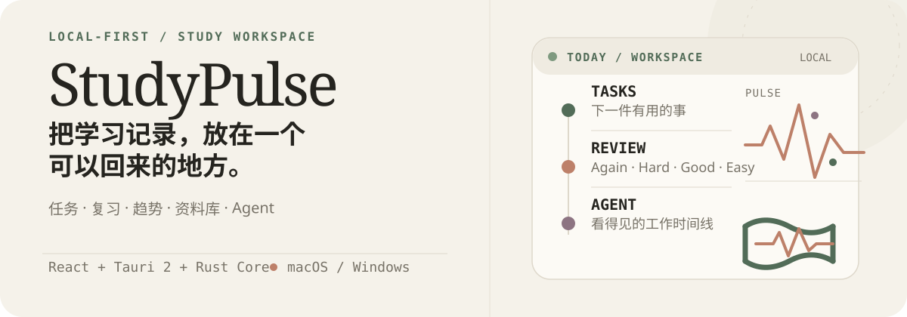
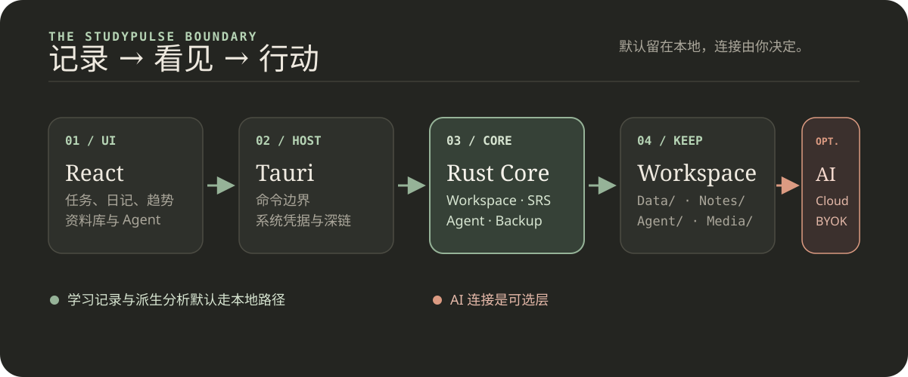

<p align="right"><a href="README.md">English</a> · 简体中文</p>

<p align="center">
  
</p>

# StudyPulse

> 一个本地优先的学习工作区桌面客户端。把任务、成绩、考试、错题、学习计时、学习日记、趋势分析、资料库和 Agent 工作，放进同一个可迁移的 Workspace。

<p>
  <code>macOS 15+</code>&nbsp;·&nbsp;
  <code>Windows 10/11</code>&nbsp;·&nbsp;
  <code>Tauri 2</code>&nbsp;·&nbsp;
  <code>React 19</code>&nbsp;·&nbsp;
  <code>Rust Core</code>
</p>

## 先看它解决什么问题

StudyPulse 不要求你先连接 AI，也不把学习记录拆散在多个工具里。它把每天的行动、复习和反思收拢到一个本地 Workspace，再从这些记录生成趋势、复习队列和下一步行动。

- **记录**：任务、科目与成绩、考试、错题、计时、时间投入和学习日记。
- **看见**：Today 快照、连续学习、90 天活动热力图、学习时长、心情/精力和科目趋势。
- **复习**：把错题加入文字闪卡，用 Again / Hard / Good / Easy 推进 SM-2 兼容的复习状态。
- **行动**：资料库和带权限确认的 Agent；Cloud AI 或 BYOK 都是可选连接。

<p align="center">
  
</p>

## 快速开始

### 桌面应用

环境要求：macOS 15 或更高版本，或 Windows 10/11；Rust 1.97.1+；Node.js 24+；npm 11+。

```sh
npm install
npm run tauri:dev
```

首次启动后，创建一个新的 Workspace，或打开已有的 Workspace。

### 只启动前端预览

```sh
npm run dev
```

Vite 默认使用 `http://localhost:1420`。浏览器预览没有 Tauri runtime，创建/打开 Workspace、文件选择、备份、AI 和 Agent command 不会正常工作；需要完整功能时请使用 `npm run tauri:dev`。

### 构建桌面应用

```sh
npm run tauri:build
```

Windows 可显式生成 NSIS 与 MSI 安装器：

```powershell
npm run tauri:build:windows
```

Windows 环境、迁移和签名说明见 [`docs/WINDOWS.md`](docs/WINDOWS.md)。

## 你可以实际使用它做什么

### 把一天放回手边

Today 页面把未完成任务、学习时长、连续学习天数、待复习错题和近期考试放在同一个视图。任务、成绩、考试和时间投入都写入本地 Workspace。

### 让进步有迹可循

学习日记支持同日多条记录、心情、精力、标签和 Markdown 内容。Trends 提供 7/30 天日记节奏与 90 天学习概览：活动热力图、学习时长、心情/精力、科目成绩趋势和 SRS 摘要。

### 用错题推动复习

错题可以进入文字闪卡队列。复习时先看到题目，再以 Again、Hard、Good、Easy 反馈；到期卡片可以在一次会话中重排，完成后显示本次复习总结。

### 需要时再让 Agent 参与

资料库可以导入文本和 Markdown，并按 Notebook 选择资料作为上下文。Agent 支持 Chat、Deep Solve、Mastery、Deep Research、Question Lab 和 Visualize 六种模式，以可见事件时间线展示阶段、状态、工具调用、产物和错误。

## AI 是可选层

没有 AI 连接时，任务、考试、错题、计时、日记、趋势、复习、资料管理和报告仍可使用。

- **StudyPulse Cloud AI**：通过 `studypulse://auth/callback` 完成登录。
- **BYOK**：配置任意 OpenAI-compatible endpoint、模型和 API key。
- Cloud AI 与 BYOK 同时只能有一个处于 active 状态。
- AI Coach、Reverse Planner 和 Exam Simulator 的生成与分析需要已连接的提供商；Learning Reports 使用本地 Workspace 数据，可导出 Markdown、HTML、PNG，或使用系统打印生成 PDF。

## 本地优先与权限边界

- 学习数据、Agent runs、Notebook 历史和导入资料保存在用户选择的 Workspace 目录。
- Cloud token 和 BYOK API key 只进入 macOS Keychain / Windows Credential Manager，不写入 Workspace、浏览器 `localStorage`、日志或前端序列化数据。
- Rust Core 是唯一读写 Workspace 与凭据的层；React 只接收脱敏后的 provider status。
- Agent 工具按 Read、Write、Destructive、Execute 分级；写入、破坏性操作和代码执行会先请求确认。
- Workspace 路径会拒绝路径穿越、符号链接逃逸、隐藏导入文件和超出大小限制的文件。

## Agent 代码执行

本机 Python 是默认后端，每次执行都需要用户确认；确认卡片会明确提示它**不是安全沙箱**。如果没有配置 Docker Runner，代码会以当前用户的主机权限运行，不要用它运行不可信代码。

如果需要容器化执行，可以使用可选 Runner：

```sh
cd core
cargo build --release -p studypulse-runner
docker build -f crates/studypulse-runner/Dockerfile -t studypulse-runner .
cd ..

STUDYPULSE_CODE_EXECUTION_BACKEND=docker npm run tauri:dev
```

也可以连接外部 Runner。此时需要同时配置 `STUDYPULSE_RUNNER_URL` 和 `STUDYPULSE_RUNNER_TOKEN`；远程 Runner URL 必须使用 HTTPS，HTTP 只允许 `localhost`、`127.0.0.1` 和 `::1`。Runner 会在执行前检查认证的 `/health`，并要求服务报告容器隔离状态。更多说明见 [`core/crates/studypulse-runner/README.md`](core/crates/studypulse-runner/README.md)。

## Workspace 长什么样

创建 Workspace 后，Rust Core 会初始化类似下面的目录结构：

```text
StudyPulseWorkspace/
├── Documents/              # 资料库文档
├── Notes/                  # 笔记与可搜索文本
├── Data/                   # 任务、成绩、考试、错题、学习 session 等记录
├── Media/images|audio/     # 用户导入的媒体
├── Agent/
│   ├── runs/               # Agent 运行记录
│   ├── artifacts/          # Agent 生成的产物
│   ├── memory/             # Workspace / Notebook memory
│   ├── notebooks/          # Notebook 作用域目录
│   └── notebooks.json      # Notebook 索引与对话历史
└── .studypulse/            # 元数据、缓存、索引和恢复点
```

记录型数据使用带版本的 JSONL envelope；写入经过进程内锁和 atomic write。Workspace schema 只接受当前或更早版本，未来版本会拒绝打开。

## 架构与代码分层

```text
frontend/       React 页面、i18n、Markdown、Tauri command 封装
src-tauri/      Tauri 宿主、文件选择器、深链、系统凭据、command 边界
core/           Rust workspace：存储、分析、Agent、工具、模型客户端、备份、Runner
```

生产桌面应用不依赖 Electron，也不对外提供浏览器 localhost 服务。`npm run dev` 只是 Vite 前端预览，不能代替 Tauri 应用运行。

## 开发验证

前端：

```sh
npm test
npm run lint
npm run typecheck
npm run build
```

Rust Core：

```sh
cargo fmt --manifest-path core/Cargo.toml --all -- --check
cargo test --manifest-path core/Cargo.toml --workspace
cargo clippy --manifest-path core/Cargo.toml --workspace --all-targets -- -D warnings
```

完整桌面构建：

```sh
npm run tauri:build
```

## 当前状态与边界

当前客户端已覆盖本地 Workspace、学习记录与 SRS、Diary / Trends / Flashcards、备份恢复、AI Coach、考试规划/模拟、学习报告，以及带权限确认的 Agent 主流程。

Health/Recovery 模块尚未包含在当前客户端中；跨端同步、完整系统级日历/提醒集成、发布签名与分发流程也不属于当前默认能力。AI 生成结果仍需用户审核，本机 Python 执行后端也不是安全沙箱。

## 维护说明

本次 README 的轻量更新由 Codex 完成。

<sub>当前仓库的桌面版本元数据为 <code>0.9.0</code>；发布状态以实际 GitHub Release 为准。</sub>
