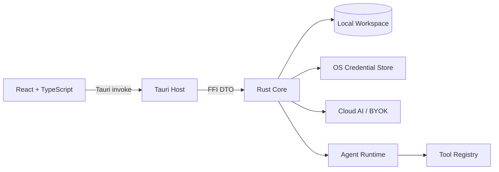

# StudyPulse Desktop Client

## 软件工程、应用安全与可维护性综合评估报告

| 项目 | 内容 |
|---|---|
| 文档版本 | 1.0 |
| 评估日期 | 2026-08-09 |
| 评估分支 | `agent/phase1-ai-foundation-v2` |
| 评估基线 | `7fa5117 Align Tauri package version with release metadata` |
| 评估对象 | StudyPulse Tauri 2 + React 19 + Rust Core 桌面客户端 |
| 评估类型 | 工程规范、安全边界、可维护性与验证能力评估 |
| 评估结论 | 有条件通过（Conditional Pass） |

---

## 1. 执行摘要

### 1.1 总体判断

StudyPulse 当前已经不是简单的功能原型，而是具备较完整工程骨架的本地优先桌面应用。项目在以下方面表现较好：

- React、Tauri、FFI、Rust Core、Workspace 的职责边界基本清晰。
- Workspace 具备路径穿越、符号链接逃逸、大小限制、JSONL envelope 和原子写入设计。
- Cloud AI 与 BYOK 凭据进入系统安全凭据存储，而不是 Workspace、`localStorage` 或前端 DTO。
- Agent 工具存在权限等级、确认流程、取消流程和 `prepare`/`execute` 分离。
- Core、Tauri 宿主和前端均有基础测试，当前本地质量检查全部通过。

但是，当前版本还不应被描述为“全面安全”或“正式生产发布就绪”。主要原因如下：

1. 自定义外部 Runner 未强制 HTTPS，Bearer Token 和代码可能通过明文 HTTP 发送。
2. 本机 Python 执行明确不是安全沙箱，获得用户确认后可使用用户主机权限。
3. 应用偏好和报告导出存在未使用统一原子写入、未明确拒绝目标符号链接的问题。
4. Release workflow 没有执行 Rust 测试和 Clippy，也没有独立 Pull Request CI 门禁。
5. 版本元数据、README 和多语言文案存在已确认的漂移。
6. 前端页面和 Tauri 宿主正在形成较大的中心化文件，UI 集成测试覆盖不足。

### 1.2 正式结论

> StudyPulse 已具备可持续迭代的工程化基础，核心安全边界设计方向正确；但在代码执行、外部 Runner 传输、发布门禁、版本一致性和 UI 测试方面仍有明确整改项。因此，本报告给予“有条件通过”结论：适合继续开发、内部验证和受控使用，完成 P0/P1 整改后再作为正式分发版本推进。

### 1.3 成熟度等级

本报告采用五级工程成熟度模型：

| 等级 | 含义 |
|---|---|
| Level 1 | 功能验证或实验性原型，缺乏稳定边界 |
| Level 2 | 基本可运行，有局部测试和工程约定 |
| Level 3 | 已形成架构、数据边界和可重复验证体系 |
| Level 4 | 具备生产发布级安全、回滚、审计和跨平台验证 |
| Level 5 | 高保证软件，具备持续合规、形式化或独立安全审计能力 |

当前评定：**Level 3——工程化基础已建立，但尚未达到高保证生产分发级别。**

---

## 2. 评估范围与方法

### 2.1 评估范围

本次评估覆盖：

- `frontend/`：React 页面、TypeScript 类型、Tauri command 封装、Markdown 渲染、i18n。
- `src-tauri/`：Tauri 宿主、IPC command、系统凭据、深链、文件写入和 capability 配置。
- `core/crates/`：Workspace、路径安全、备份、Agent、工具、模型客户端、FFI 和 Runner。
- `.github/workflows/`：构建、测试、发布、权限和供应链配置。
- `package.json`、Cargo manifests、lockfiles、README 与发布模板。

本次不包含：

- 独立渗透测试或红队测试。
- macOS Keychain、Windows Credential Manager 的实机安全测试。
- Windows 实机编译、安装、升级和卸载测试。
- 正式代码签名、公证、SmartScreen 或 Gatekeeper 验证。
- 真实 Cloud AI/BYOK 生产接口的网络安全测试。
- Docker 内核隔离、宿主机逃逸和容器镜像供应链审计。

### 2.2 证据等级

| 等级 | 定义 |
|---|---|
| A | 本次直接运行并获得退出码或测试结果 |
| B | 基于当前 checkout 源码、配置和测试实现的静态审查 |
| C | 本次未执行，不能据此宣称通过 |

### 2.3 工作区状态说明

评估开始时工作区存在以下未提交文件：

- `.idea/`
- `docs/SWIFT_AI_FEATURE_PARITY.md`
- `docs/SWIFT_FEATURE_PARITY_GAPS.md`

上述文件均被视为用户既有变更，未修改、未清理，也未作为本评估报告的代码质量证据。

---

## 3. 系统架构评估

### 3.1 架构概览



### 3.2 架构优点

#### 3.2.1 Core 作为唯一数据边界

前端不直接读取 Workspace 文件，也不直接操作系统凭据。Tauri 宿主负责 command 边界，Rust Core 负责数据模型、路径验证、持久化和 AI/Agent 逻辑。

这一设计减少了以下风险：

- 前端绕过 Workspace 校验直接读写文件。
- API Key 进入浏览器状态或序列化 DTO。
- React 页面重复实现数据校验和业务规则。
- 不同页面对 JSONL 或备份格式做出不一致解释。

#### 3.2.2 同步 Core 操作被移入 blocking pool

Tauri 宿主通过 `core_call` 将同步 Core 操作放入 `spawn_blocking`，避免文件 I/O、锁等待和 Workspace 操作阻塞 Tauri 事件循环。

参考文件：

- `src-tauri/src/lib.rs:310`
- `src-tauri/src/lib.rs:315`

#### 3.2.3 Workspace 的数据契约较成熟

Workspace 使用带版本的 JSONL envelope、未知字段保留、UUID upsert、RFC3339 时间戳、写锁和原子写入。这些设计有利于跨版本兼容和未来字段扩展。

参考文件：

- `core/crates/studypulse-workspace/src/models.rs`
- `core/crates/studypulse-workspace/src/workspace.rs`
- `core/crates/studypulse-workspace/src/backup.rs`

### 3.3 架构风险

#### 3.3.1 FFI 和宿主文件规模偏大

当前主要文件规模如下：

| 文件 | 行数 | 评估 |
|---|---:|---|
| `frontend/src/app/App.tsx` | 617 | 页面选择、全局状态、设置、Agent 和多个页面入口集中在一起 |
| `src-tauri/src/lib.rs` | 1387 | command、凭据、偏好、报告和启动配置集中 |
| `core/crates/studypulse-ffi/src/lib.rs` | 4290 | 统一 FFI facade 和 DTO 集中 |
| `core/crates/studypulse-workspace/src/workspace.rs` | 1731 | Workspace 读写、Library、Agent 数据和导出逻辑集中 |
| `core/crates/studypulse-tools/src/lib.rs` | 1738 | 工具定义、校验、执行和 Runner 逻辑集中 |
| `core/crates/studypulse-agent/src/lib.rs` | 1734 | Agent 状态机、事件和等待逻辑集中 |
| `core/crates/studypulse-model-client/src/lib.rs` | 2076 | Provider、协议解析、SSE 和错误映射集中 |

这些文件当前仍可维护，但已经接近“领域模块应开始拆分”的临界点。继续添加 AI 功能、系统集成或更多记录类型时，建议减少中心文件的职责密度。

---

## 4. 代码规范性评估

### 4.1 已符合的规范

#### 4.1.1 TypeScript 严格模式

`tsconfig.app.json` 启用了：

- `strict: true`
- `forceConsistentCasingInFileNames: true`
- `isolatedModules: true`
- `noEmit: true`

本次 `npm run typecheck` 通过，说明当前类型边界没有发现编译级错误。

#### 4.1.2 ESLint 规则有效

当前 ESLint 配置包含：

- ESLint recommended rules
- TypeScript ESLint
- React Hooks rules
- React Refresh rules

本次 `npm run lint` 通过。

#### 4.1.3 Rust 格式和 Clippy 约束有效

本次通过：

```sh
cargo fmt --manifest-path core/Cargo.toml --all -- --check
cargo clippy --manifest-path core/Cargo.toml --workspace --all-targets -- -D warnings
cargo clippy --manifest-path src-tauri/Cargo.toml --all-targets -- -D warnings
```

这说明 Rust 代码当前没有格式偏差，也没有被 Clippy 判定为警告级问题。

### 4.2 已发现的规范偏差

#### 4.2.1 备份版本信息未跟随应用版本

当前应用版本已经是 `0.6.0`，且以下版本持有者一致：

- `package.json`
- `package-lock.json`
- `core/Cargo.toml`
- `src-tauri/Cargo.toml`
- `src-tauri/tauri.conf.json`

但是前端备份导出仍传递：

```ts
app_version: "0.5.1"
```

参考：`frontend/src/lib/core.ts:242`

这不是立即的远程安全漏洞，但会导致备份元数据、诊断和兼容性判断不准确，属于发布数据契约问题。

#### 4.2.2 README 版本信息过期

README 当前仍包含 `0.5.0` 版本元数据，而应用和构建配置已经是 `0.6.0`。

参考：`README.md:183`

建议使用统一版本来源，避免 README、备份、发布说明和应用配置分别维护。

#### 4.2.3 多语言覆盖不完整

`frontend/src/i18n.tsx` 已明确写出：`zh-TW`、日语和韩语没有合并 P2 字典，缺少的文案会回退英文。

参考：

- `frontend/src/i18n.tsx:202`
- `frontend/src/i18n.tsx:207`

这与项目自身“新增用户可见字符串应补齐五种语言”的规范不完全一致。建议添加自动化 key parity 测试，而不是依赖人工检查。

---

## 5. 应用安全评估

### 5.1 凭据安全

#### 5.1.1 正面控制

Cloud token 和 BYOK API Key 使用系统凭据存储：

- macOS：Keychain
- Windows：Credential Manager

前端只接收脱敏的 `ProviderStatus`，不接收 API Key 原文。BYOK 错误处理还会对响应中的 API Key 做替换，避免第三方服务回显密钥时继续向 UI 泄露。

参考文件：

- `src-tauri/src/lib.rs:37`
- `src-tauri/src/lib.rs:63`
- `core/crates/studypulse-model-client/src/lib.rs:1417`

#### 5.1.2 残余风险

当前 API Key 和 token 必然会在进程内存中存在，代码没有对内存字符串进行 zeroization。对于普通桌面应用这是常见折中，但如果威胁模型包含进程内存转储，则需要进一步采用受保护的秘密类型和生命周期管理。

### 5.2 Workspace 与路径安全

Workspace 路径安全属于当前项目的强项，包含：

- 拒绝绝对路径、盘符、`..`、空路径段和反斜杠。
- 检查路径组件是否为符号链接。
- canonicalize 后再次检查是否仍位于 Workspace root 内。
- 对导入文件、媒体、Agent artifact 施加大小限制。
- Library 遍历不跟随符号链接。
- 关键写入使用临时文件和 rename。

参考文件：

- `core/crates/studypulse-workspace/src/safe_path.rs`
- `core/crates/studypulse-workspace/src/workspace.rs:214`
- `core/crates/studypulse-workspace/src/workspace.rs:1452`

相关测试已经覆盖符号链接逃逸和导入文件边界。

### 5.3 Agent 工具安全

#### 5.3.1 正面控制

当前 Agent 工具体系具备：

- Read、Write、Execute 等权限等级。
- `prepare` 阶段只校验，不产生写入副作用。
- Write 和 Execute 工具需要确认。
- 工具参数使用 `deny_unknown_fields` 和 schema 定义。
- 文件读取受 Notebook source selection 约束。
- Agent artifact、Memory 和搜索结果存在大小限制。
- Agent run 支持取消、输入等待和事件序号。

其中，`create_task` 的测试专门验证了 prepare 阶段不会提前写入数据，这是非常重要的安全回归保护。

#### 5.3.2 本机 Python 不是安全沙箱

本机代码执行使用隔离工作目录、清空环境变量、超时、stdin/stdout/stderr 限制和 Python `-I` 参数，但仍然运行在用户主机权限下。

README 已经对此进行了诚实披露：

> 本机 Python 是默认后端，每次执行都需要用户确认，但它不是安全沙箱。

参考：`README.md:100-103`、`core/crates/studypulse-tools/src/lib.rs:1317`

因此，当前模型只能表述为“带确认和资源限制的本机代码执行”，不能表述为“安全执行环境”。如果 Agent 连接了不完全可信的模型、资料或外部内容，这一边界属于高风险残余项。

### 5.4 外部 Runner 传输安全

这是当前最重要的代码级安全问题之一。

自定义 Runner URL 和 Token 的读取逻辑位于：

```text
core/crates/studypulse-tools/src/lib.rs:277
```

Runner 会检查 Bearer Token 并访问 `/health`，随后向 `/v1/execute` 发送代码和 stdin：

```text
core/crates/studypulse-tools/src/lib.rs:449
core/crates/studypulse-tools/src/lib.rs:1561
```

但是，自定义 URL 没有要求必须使用 HTTPS。默认地址是本机 HTTP，这在本机容器场景可以接受；问题在于自定义远程地址也可以是 HTTP。

风险包括：

- Bearer Token 被网络监听者获取。
- 用户代码、stdin、stdout 和 stderr 被窃听或篡改。
- 恶意中间人伪造健康检查结果或执行结果。

建议：

1. 对非 loopback 地址强制 `https`。
2. 仅允许 `http` 用于 `127.0.0.1`、`localhost` 和 `::1`。
3. 关闭或严格限制 HTTP 重定向，避免 Bearer Token 被带到其他域名。
4. 为远程 Runner 增加证书错误、域名和部署信任说明。
5. 增加不安全 URL 的单元测试和集成测试。

### 5.5 报告导出路径安全

报告路径检查目前会：

- 验证扩展名。
- canonicalize 父目录。
- 拒绝将报告写入 Workspace 根目录。

参考：`src-tauri/src/lib.rs:926`

但目标文件本身没有通过 `symlink_metadata` 或等价机制进行符号链接拒绝，随后直接调用：

```text
src-tauri/src/lib.rs:948
src-tauri/src/lib.rs:960
```

这会留下以下潜在问题：如果目标文件已经是符号链接，`fs::write` 可能跟随符号链接写入另一个文件。虽然正常 UI 流程使用用户文件选择器，攻击面低于 Workspace command，但宿主边界不应仅依赖“前端是可信 UI”这一假设。

建议使用：

- 创建新文件时使用 `create_new`。
- 覆盖前使用 `symlink_metadata` 明确拒绝符号链接。
- 写入前后重新检查目标路径。
- 对导出目录建立明确的用户选择和来源约束。

### 5.6 应用偏好写入安全

Workspace 数据使用原子写入，但 Tauri 应用偏好使用直接 `fs::write`：

```text
src-tauri/src/lib.rs:186
```

偏好文件不是核心 Workspace 业务数据，因此该问题不会直接破坏主要学习记录；但在断电、进程崩溃或磁盘异常时可能造成偏好 JSON 截断或启动状态异常。

建议将偏好文件也纳入统一的临时文件、flush、rename 机制，并增加模拟写入失败的测试。

### 5.7 Markdown、CSP 与前端注入

Agent Markdown 使用 `ReactMarkdown` 和 `rehype-sanitize`，没有发现直接使用 `dangerouslySetInnerHTML` 的业务渲染路径。这是良好控制。

参考：`frontend/src/app/App.tsx:592`

Tauri CSP 当前包含：

```text
script-src 'self' 'unsafe-eval'
```

参考：`src-tauri/tauri.conf.json:25`

`unsafe-eval` 会降低 CSP 防护强度。当前未证明其已造成可利用漏洞，但应确认生产构建是否确实需要；如果不需要，应移除。

---

## 6. 可维护性评估

### 6.1 当前可维护性优点

#### 6.1.1 类型和错误边界较清晰

Rust 使用领域错误类型，Tauri 使用 `AppError`，前端通过统一 command wrapper 调用。Core DTO 和前端类型之间存在明确转换边界。

#### 6.1.2 数据格式具备演进能力

模型使用 camelCase 存储、未知字段保留、旧字段默认值和版本化备份。未来增加字段时不必立刻破坏旧 Workspace。

#### 6.1.3 测试集中在高风险 Core 能力

现有测试重点覆盖：

- 路径安全。
- 备份 schema 和 recovery。
- Agent 取消和确认。
- 工具 prepare/execute 分离。
- AI callback、token prefix、SSE 和 OpenAI tool call。
- Workspace round trip。

这些测试选择是合理的。

### 6.2 可维护性不足

#### 6.2.1 前端页面集中度偏高

`App.tsx` 同时承担页面路由、全局 snapshot、认证恢复、Workspace 入口、Settings、Agent 和部分页面组件；随着功能增加，任何共享状态修改都可能影响多个页面。

建议按领域拆分：

- `app/shell/`
- `pages/today/`
- `pages/agent/`
- `pages/settings/`
- `pages/coach/`
- `pages/reports/`
- `hooks/`
- `components/`

#### 6.2.2 UI 自动化测试不足

当前前端测试只有三个文件，主要覆盖：

- Core bridge 在浏览器环境中 fail closed。
- Agent Python 事件解析。
- 视觉主题持久化。

没有覆盖：

- Workspace 创建和打开完整流程。
- 设置页面凭据输入和脱敏显示。
- Agent 确认、拒绝、输入等待和取消 UI。
- 备份 inspect/apply 流程。
- 报告导出和分享。
- 页面级 loading/error/empty/success 状态。
- 真实 Tauri runtime 下的 command 交互。

#### 6.2.3 缓存失效策略仍有集中式倾向

App 层存在 broad refresh，即全量 invalidate queries。短期简单，长期会导致：

- 不必要的重复读取。
- 页面之间的刷新依赖隐式行为。
- 性能分析困难。
- 写入后数据依赖变得不明显。

建议逐步改为领域级 query key 和显式依赖刷新。

---

## 7. 测试与验证报告

### 7.1 本次直接执行并通过的检查

| 检查项 | 结果 | 证据等级 |
|---|---|---|
| `npm test` | 3 个文件、8 个测试通过 | A |
| `npm run lint` | 通过 | A |
| `npm run typecheck` | 通过 | A |
| `npm run build` | 通过 | A |
| `cargo fmt --manifest-path core/Cargo.toml --all -- --check` | 通过 | A |
| `cargo test --manifest-path core/Cargo.toml --workspace` | 61 个测试通过 | A |
| `cargo clippy --manifest-path core/Cargo.toml --workspace --all-targets -- -D warnings` | 通过 | A |
| `cargo test --manifest-path src-tauri/Cargo.toml` | 3 个测试通过 | A |
| `cargo clippy --manifest-path src-tauri/Cargo.toml --all-targets -- -D warnings` | 通过 | A |
| `npm audit --omit=dev --audit-level=high` | 0 个高危及以上漏洞 | A |

Rust Core 测试分布如下：

| Crate | 测试数 |
|---|---:|
| `studypulse-agent` | 8 |
| `studypulse-ffi` | 6 |
| `studypulse-model-client` | 17 |
| `studypulse-tools` | 5 |
| `studypulse-workspace` | 25 |
| `studypulse-runner` | 0 |
| **合计** | **61** |

加上前端 8 个和 Tauri 宿主 3 个，本次实际通过的测试总数为 **72 个**。

### 7.2 构建警告

前端构建通过，但 Vite 报告主 chunk 超过 500 kB：

- 未压缩 chunk：约 575.08 kB
- gzip：约 165.84 kB

这不是当前安全漏洞，但说明随着功能增加，未来应考虑动态加载和页面级 code splitting。

### 7.3 本次未验证项目

以下项目不能标记为通过：

- `npm run tauri:build` 完整桌面 bundle。
- macOS `.app`、`.dmg` 实机启动和安装。
- Windows `.exe`/`.msi` 构建和安装。
- 真实 Keychain/Credential Manager 行为。
- 真实 Cloud AI、BYOK、深链认证回调。
- Docker Runner 容器隔离。
- 页面截图、交互和可访问性全量覆盖。
- 代码签名、公证和发布后的安装信誉。
- Rust 依赖漏洞扫描；当前环境未安装 `cargo-audit`。

---

## 8. CI/CD 与发布治理评估

### 8.1 当前 CI 的优点

Release workflow 已包含：

- macOS Apple Silicon 构建。
- Windows x86_64 构建。
- npm 安装、前端测试、TypeScript 检查和 Lint。
- 构建产物存在性检查。
- 发布前等待两个平台构建完成。
- Release 权限仅在 publish job 中提升到 `contents: write`。

参考：`.github/workflows/release.yml`

### 8.2 CI 的主要缺口

当前 workflow 在构建前没有执行：

- `cargo fmt --check`
- `cargo test --workspace`
- `cargo clippy -- -D warnings`
- `npm run build` 独立检查
- 依赖漏洞扫描
- Secret scanning
- Pull Request workflow

workflow 当前只执行前端测试、类型检查和 Lint，然后直接构建 Tauri bundle：

参考：`.github/workflows/release.yml:50-60`

这意味着 Rust Core 可能存在回归，而 Release workflow 仍然继续进行到打包阶段。

### 8.3 发布安全状态

README 和 Release Template 都明确说明当前产物未进行 Developer ID 签名、公证或 Windows 代码签名。

参考：

- `README.md:177`
- `.github/release-template.md:55`

因此，本项目当前可以生成发布包，但不能将其描述为受信任的正式分发构建。

---

## 9. 风险登记表

### 9.1 高优先级风险

| ID | 风险 | 级别 | 当前状态 | 建议措施 |
|---|---|---|---|---|
| SEC-01 | 外部 Runner 非 HTTPS 传输 | 高 | 未修复 | 非 loopback 强制 HTTPS；关闭跨域重定向；增加测试 |
| SEC-02 | 本机 Python 非沙箱 | 高 | 已披露，仍存在 | 默认使用容器化 Runner，或默认关闭本机执行；强化确认界面 |

### 9.2 中优先级风险

| ID | 风险 | 级别 | 当前状态 | 建议措施 |
|---|---|---|---|---|
| SEC-03 | 报告导出目标可能跟随符号链接 | 中 | 未修复 | 使用 `create_new`/`symlink_metadata`/目标重检 |
| DATA-01 | 备份版本硬编码为 0.5.1 | 中 | 已确认 | 从统一构建版本注入，不允许页面硬编码 |
| DATA-02 | 偏好写入非原子 | 中 | 已确认 | 复用统一 atomic write helper |
| REL-01 | CI 缺少 Rust 门禁和 PR workflow | 中 | 已确认 | 增加独立 `ci.yml`，Release 依赖 CI 结果 |
| I18N-01 | P2 文案未覆盖五种语言 | 中 | 已确认 | 完善字典并添加 key parity 测试 |
| MAINT-01 | 大型中心文件持续增长 | 中 | 结构性风险 | 按页面、领域和 command 拆分 |

### 9.3 低优先级和治理风险

| ID | 风险 | 级别 | 当前状态 | 建议措施 |
|---|---|---|---|---|
| SEC-04 | CSP 含 `unsafe-eval` | 低/中 | 待确认 | 生产配置中移除不必要的 eval |
| DOC-01 | README 与当前版本不一致 | 低 | 已确认 | 发布时自动生成或校验文档版本 |
| SUP-01 | GitHub Actions 使用浮动 tag | 低/中 | 已确认 | 固定到 commit SHA，并定期升级 |
| SUP-02 | 未配置 Dependabot、CodeQL 或 cargo audit | 低/中 | 未发现配置 | 增加持续依赖和供应链扫描 |

---

## 10. 整改路线图

### Phase 0：发布阻断项

目标：降低真实凭据和代码执行风险。

1. 修复 SEC-01：外部 Runner 仅允许 HTTPS，loopback 才允许 HTTP。
2. 明确 SEC-02 产品策略：
   - 默认 Docker Runner；或
   - 本机执行默认关闭；或
   - 仅允许用户显式打开并展示不可逆主机权限警告。
3. 为 Runner 增加重定向、URL scheme、Token 不泄露和错误配置测试。
4. 在发布说明中继续明确本机 Python 不属于安全沙箱。

### Phase 1：数据可靠性和发布质量

1. 统一应用版本来源，修复备份 `app_version`。
2. 应用偏好和报告导出使用安全原子写入。
3. 拒绝导出目标符号链接。
4. 新增 Pull Request CI：
   - 前端 test/lint/typecheck/build。
   - Rust fmt/test/clippy。
   - npm audit 和 Rust 依赖审计。
5. 将 Release workflow 改为依赖已通过的质量门禁。

### Phase 2：可维护性和用户体验

1. 拆分 `App.tsx` 和 `src-tauri/src/lib.rs`。
2. 统一 React Query invalidation 策略。
3. 补齐五种语言 P2 文案。
4. 增加页面级 loading/error/empty/success 状态测试。
5. 增加真实 Tauri runtime 的关键流程测试。
6. 移除不需要的 `unsafe-eval`。

### Phase 3：正式分发准备

1. macOS Developer ID 签名和公证。
2. Windows 代码签名和时间戳。
3. 产物 checksum、SBOM 和发布审计记录。
4. 真实 macOS/Windows 安装、升级、卸载和 Workspace 迁移测试。
5. 评估带签名 updater 的设计与回滚策略。

---

## 11. 整改验收标准

### 安全验收

- [ ] 非 loopback Runner URL 使用 HTTP 时被拒绝。
- [ ] HTTPS Runner 重定向不会向新域名发送原 Bearer Token。
- [ ] Runner 认证失败不会泄露 Token、代码或 stdin。
- [ ] 本机代码执行 UI 明确标注“不是安全沙箱”。
- [ ] 报告导出目标符号链接被拒绝。
- [ ] API Key 不出现在前端 DTO、日志、错误正文和 Workspace。

### 数据验收

- [ ] 备份 manifest 的 `app_version` 与所有版本持有者一致。
- [ ] 应用偏好写入具备崩溃恢复能力。
- [ ] 报告导出中断不会留下半截目标文件。
- [ ] 版本漂移有自动化测试拦截。

### CI 验收

- [ ] Pull Request 自动执行前端和 Rust 全部质量检查。
- [ ] Release 不能绕过 Rust test 和 Clippy。
- [ ] 依赖漏洞扫描纳入 CI 或定期任务。
- [ ] GitHub Actions 版本固定或有可追踪升级策略。

### 可维护性验收

- [ ] `App.tsx` 页面职责拆分完成。
- [ ] Tauri command 按领域拆分完成。
- [ ] 五种语言 key parity 测试通过。
- [ ] Agent 确认、拒绝、取消、输入等待具有 UI 集成测试。
- [ ] 备份和报告导出具有 Tauri runtime 测试。

---

## 12. 最终评定矩阵

| 维度 | 评定 | 说明 |
|---|---|---|
| 架构分层 | B+ | 领域边界清晰，Core 作为主要数据边界 |
| 代码规范 | B | TypeScript/Rust 基础规范良好，但存在版本和 i18n 漂移 |
| 数据安全 | B+ | Workspace 路径、备份和凭据边界设计较强 |
| Agent 安全 | B- | 确认流程合理，但本机代码执行具有高残余风险 |
| 网络安全 | C+ | Cloud/BYOK 基础较好，但外部 Runner HTTPS 约束不足 |
| 可维护性 | B- | 当前可维护，但中心文件和 FFI 规模偏大 |
| 测试体系 | B- | Core 测试较扎实，UI/端到端测试不足 |
| CI/CD 治理 | C+ | 有跨平台发布流程，但缺少 Rust 门禁、PR CI 和依赖审计 |
| 正式分发 | C | 尚未完成签名、公证和跨平台实机验证 |

## 13. 最终结论

StudyPulse 当前具备继续开发和内部验证的条件，且其 Workspace、凭据和 Agent 权限设计已经形成较好的安全基础。

但在完成以下事项前，不建议将其描述为“全面安全”或“正式生产就绪”：

1. 修复外部 Runner 的 HTTPS 传输边界。
2. 对本机 Python 执行采取更严格的默认策略。
3. 修复版本元数据、原子写入和报告目标符号链接问题。
4. 建立包含 Rust test/Clippy 的 Pull Request CI。
5. 补齐多语言和关键 Tauri 流程测试。
6. 完成签名、公证、Windows 代码签名和跨平台实机验证。

在上述整改完成前，推荐使用以下产品级表述：

> StudyPulse 是一款具备本地优先数据边界、系统凭据隔离和 Agent 权限确认机制的工程化桌面客户端，当前适合受控使用和持续迭代；部分代码执行、远程 Runner、发布签名和跨平台验证能力仍处于加固阶段。
